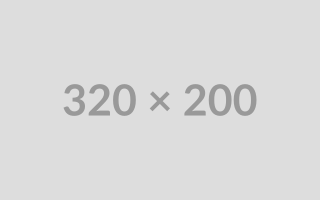

# LaraCMS

Alpha Development Build of LaraCMS

## Description

LaraCMS is an open-source content management system (CMS) built on the Laravel framework. It aims to provide a user-friendly interface for managing and publishing content on the web. The system is highly customizable, extensible, and designed to cater to various types of websites, including blogs, business websites, and more.

## Features

-   Easy-to-use admin panel
-   Flexible content creation and management
-   Customizable themes and templates
-   User management and roles
-   SEO-friendly URLs and meta tags
-   Media management and uploading
-   Extensible through plugins and modules
-   RESTful API for developers
-   and more...

## Installation

Please refer to the [Installation Guide](/docs/installation.md) for detailed instructions on how to set up and configure LaraCMS.

## Documentation

For comprehensive documentation and usage examples, visit the [Documentation](/docs) directory.

## Getting Started

If you want to contribute to this project or set up a development environment, please refer to the [Contributing Guide](/CONTRIBUTING.md).

## Bugs and Feature Requests

If you encounter any bugs or have ideas for new features, feel free to submit an issue on the [Issue Tracker](https://github.com/Vilkrin/LaraCMS/issues). Please follow the issue template provided.

## License

LaraCMS is open-source software licensed under the [MIT License](LICENSE).

## Contributors

We thank the following contributors who have helped develop this project:

-   John Doe ([@john_doe](https://github.com/john_doe))
-   Jane Smith ([@jane_smith](https://github.com/jane_smith))
-   ...

## Acknowledgments

We would like to acknowledge the following projects and libraries that have inspired or directly contributed to LaraCMS:

-   Laravel ([https://laravel.com/](https://laravel.com/))
-   Laravel Livewire ([https://livewire.laravel.com/](https://livewire.laravel.com/))
-   Laravel Jetstream ([https://jetstream.laravel.com/](https://jetstream.laravel.com/))
-   Tailwind CSS ([https://tailwindcss.com/](https://tailwindcss.com/))
-   ...

## Support

For any questions or support, you can reach out to us at [support@your_cms_project_name.com](mailto:support@your_cms_project_name.com).
